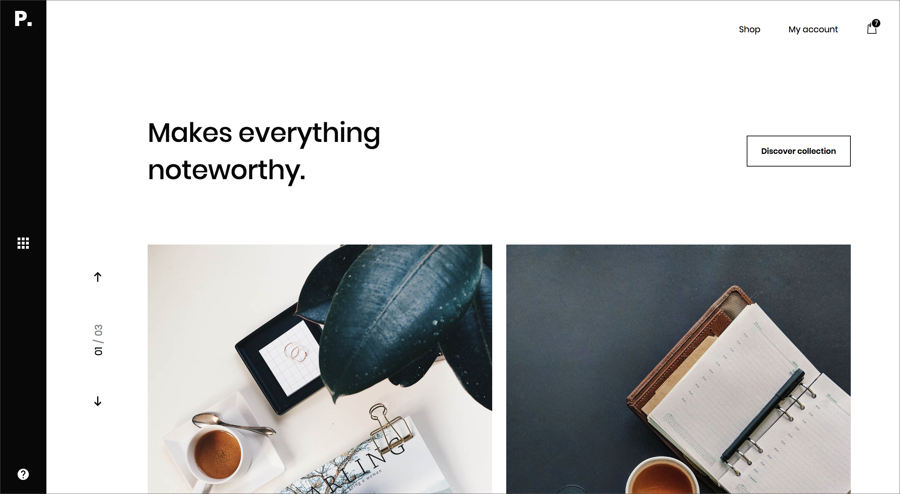

#### Design credit of the project: Patrik Michalicka

* https://dribbble.com/shots/4414196-paperan-shopping-exploration-Add-to-cart
* https://dribbble.com/shots/4104241-paperan-shopping-exploration
* https://dribbble.com/shots/4185894-paperan-shopping-exploration-collection

---

#### Paperan

> This project is an implementation of design concept Paperan from Designer Patrik Michalicka. Paperan is a small ecommerce app for office supplies. The purpose of building this app is to solidify my knowledge in React & Redux. All random API data are created from [JSON Generator](https://next.json-generator.com/) and just for illustration purpose.

#### Features of the app

* Add products in cart, remove them from cart
* Persist data in cart on page refresh
* Lazy loading on images
* Image zoom on hover
* Sidebar filter (type, price range, color, sheet style, cover material and audience)
* Sorting (best sellers, price, most reviews, top-rated and newest)
* Grid display (small & large size)
* Search bar (keywords limited to type, color, sheet style, cover material and audience)
* Responsive on different viewports
* Authentication (in progress)

#### Notes on my work

* I am working on checkout page and authentication.

Redux store works as a global immutable state tree and it prevents props drilling problems as the app grows. I used some new features in React 16.3 in this app in combination with Redux ([React Context API](https://reactjs.org/docs/context.html), [getDerivedStateFromProps](https://reactjs.org/docs/react-component.html#static-getderivedstatefromprops)).

Additional features/UI I added to the app that are not related to the original design:

* Sidebar Filter
* Sorting
* Footer
* Checkout Page (in progress)

#### Stack

* [React](https://github.com/facebook/react)
* [React Router](https://github.com/ReactTraining/react-router)
* [Redux](https://github.com/reactjs/redux)
* [Redux Persist](https://github.com/rt2zz/redux-persist)
* [Firebase](https://firebase.google.com/)

#### Demo

https://paperan-shop.firebaseapp.com



#### Quick Start

**Clone the project**

```shell
$ git clone https://github.com/trunglive/paperan-shopping.git
```

**Run the app**

```shell
$ cd paperan-shopping
$ yarn install
$ yarn start
```

#### Contributor

Trung Vo ([trunglive](https://github.com/trunglive))

#### License

This project is licensed under the MIT License. Please check the `LICENSE` file.
